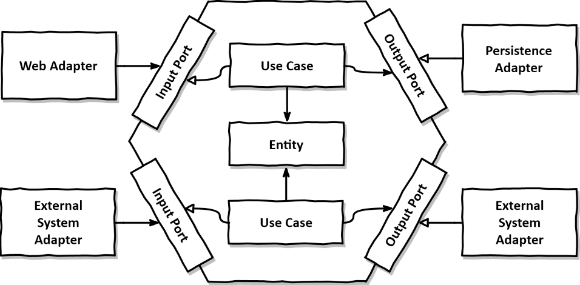

# Tutorial 2: Refatoração para Arquitetura Hexagonal

## Java Spring Boot + SQLite + Clean Architecture

### Sumário Executivo

Este tutorial refatora o sistema CRUD de usuários da **arquitetura em 3 camadas** para **Arquitetura Hexagonal** (também conhecida como **Ports and Adapters** ou **Clean Architecture**), aplicando conceitos avançados de **Domain-Driven Design (DDD)** e **princípios de Clean Code**.

Acesso ao código em 3 camadas para iniciar o tutorial:
[Acesse o repositório no GitHub](https://github.com/leonardorsolar/user-hexagonal-java-1-2-crud)

---

## Parte 1: Fundamentos da Arquitetura Hexagonal

### 1.1 O que é Arquitetura Hexagonal?

A **Arquitetura Hexagonal** foi criada por **Alistair Cockburn**.
A Arquitetura Hexagonal, também chamada de Ports and Adapters, é um modelo de organização de software que separa a lógica de negócio (o núcleo da aplicação) das partes externas, como banco de dados, APIs e interface web.

Vamos visualizar forma de vermos a Arquitetura para entendermos melhor como aplicá-la.



-   A regra de negócio fica no centro (núcleo).

-   As interfaces externas (como controller, banco de dados, e-mail) se conectam ao núcleo por meio de portas (interfaces) e adaptadores (implementações).

-   Isso facilita testes, manutenção e troca de tecnologias.

🧠 Exemplo simples:
Você pode trocar o banco de dados sem mudar a lógica da aplicação.

Pode testar tudo sem subir o servidor.

Vamos comprender mais a base desta arquitetura.

```
+---------------------+
|   InterfaceClasse  |  <<interface>>
+---------------------+
          ^
          |
+---------------------+
|     ClasseImpl     |  implements InterfaceClasse (classe concreta)
+---------------------+
```

## O que é **implementar uma interface**?

É criar uma classe que **segue esse contrato**, ou seja, define o comportamento dos métodos que foram apenas declarados na interface.

---

### 🧩 Exemplo da interface:

```java
public interface UsuarioService {
    UsuarioDTO criar(CreateUsuarioDTO dto);
    UsuarioDTO atualizar(Long id, UpdateUsuarioDTO dto);
    void deletar(Long id);
}
```

Essa interface define **o que deve ser feito**, mas **não diz como**.

---

### 🔧 Exemplo da implementação:

```java
public class UsuarioServiceImpl implements UsuarioService {

    @Override
    public UsuarioDTO criar(CreateUsuarioDTO dto) {
        // Aqui você coloca a lógica para criar um usuário
    }

    @Override
    public UsuarioDTO atualizar(Long id, UpdateUsuarioDTO dto) {
        // Aqui você coloca a lógica para atualizar um usuário
    }

    @Override
    public void deletar(Long id) {
        // Aqui você coloca a lógica para deletar um usuário
    }
}
```

---

### ✅ Resumo:

-   A **interface** é o **contrato**: define _o que precisa ser feito_.
-   A **classe que implementa a interface** fornece a **lógica real**: define _como isso será feito_.

```
`  +---------------------+
  |      Controller      |  <- Adapter (classe concreta)
  | (UsuarioController)  |
  +----------+----------+
             |
             v
     +-----------------+
     |   Input Port    |  <- Interface
     | (UsuarioService)|
     +-------+---------+
             ^
             |
     +--------------------+
     |     **Core**       |  <- Implementação da lógica (classe concreta)
     |(UsuarioServiceImpl)|
     +-------+------------+
             |
             v
    +--------------------+
    |  Output Port       |  <- Interface
    | (UsuarioRepository)|
    +-------+------------+
             ^
             |
  +-------------------------+
  |      Adapter            |
  | (UsuarioRepositoryImpl) |   <- Adapter (classe concreta)
  |     Database            |
  +--------------------------+`

```

### Observe aqui que o centro UsuarioServiceImpl (Core da aplicação) aponta (usa) a classe de cima (UsuarioService) e aponta (usa) a classe de baixo (UsuarioRepository) e as classe que a core usa são interfaces (contratos) e não classe concretas.

---

-   **Controller (Adapter):** recebe requisições e chama o InputPort.
-   **InputPort (Interface):** define os métodos que o Controller usa.
-   **Core (Implementação):** a lógica do serviço implementa InputPort.
-   **OutputPort (Interface):** abstrai o acesso a dados.
-   **Adapter (Database):** implementa OutputPort para persistência real.

### 🔁 Diagrama **sem interfaces (acoplado)** para comparar:

```text
  +---------------------+
  |     Controller      |
  | (UsuarioController) | (classe concreta)
  +----------+----------+
             |
             v
     +--------------------+
     |     Service        |
     |(UsuarioServiceImpl)|  (classe concreta)
     +--------+-----------+
              |
              v
     +--------------------------+
     |     Repository Impl      |  (classe concreta)
     | (UsuarioRepositoryImpl)  |
     +--------------------------+
```

### 🧨 Problema aqui:

-   O `Controller` chama diretamente a implementação (`ServiceImpl`), que por sua vez chama diretamente o `RepositoryImpl`.
-   Isso **viola o DIP (Princípio da Inversão de Dependência)**.
-   Torna o sistema mais rígido e difícil de testar.

---

### ✅ Já o primeiro diagrama:

-   Usa **interfaces entre as camadas**, garantindo **desacoplamento**.
-   Permite trocar implementações facilmente.
-   Favorece testes com _mocks_ e simulações.

### Outra forma de visualizar o diagrama:

```
┌───────────────────────────────────────────────────────────┐
│                     WORLD OUTSIDE                         │
│  ┌──────────────┐  ┌──────────────┐  ┌──────────────┐     │
│  │   Web API    │  │   Database   │  │  External    │     │
│  │  (Adapter)   │  │  (Adapter)   │  │   Services   │     │
│  └──────┬───────┘  └──────┬───────┘  └──────┬───────┘     │
│         │                 │                 │             │
│  ┌──────▼───────┐  ┌──────▼───────┐  ┌──────▼───────┐     │
│  │ Input Port   │  │Output Port   │  │Output Port   │     │
│  │(Interface)   │  │(Interface)   │  │(Interface)   │     │
│  └──────┬───────┘  └──────┬───────┘  └──────┬───────┘     │
│         │                 │                 │             │
│         └─────────────────┼─────────────────┘             │
│                           │                               │
│    ┌─────────────────────▼─────────────────────┐          │
│    │           HEXAGON (CORE)                  │          │
│    │                                           │          │
│    │  ┌─────────────────────────────────────┐  │          │
│    │  │         APPLICATION LAYER           │  │          │
│    │  │     (Use Cases / Services)          │  │          │
│    │  │                                     │  │          │
│    │  │  ┌─────────────────────────────┐    │  │          │
│    │  │  │       DOMAIN LAYER          │    │  │          │
│    │  │  │   (Entities / Business)     │    │  │          │
│    │  │  │                             │    │  │          │
│    │  │  └─────────────────────────────┘    │  │          │
│    │  └─────────────────────────────────────┘  │          │
│    └───────────────────────────────────────────┘          │
└───────────────────────────────────────────────────────────┘
```

Outra base para entender a arquitetura Hexagonal é o conceito de Inversão de Dependência (ou Inversão de Controle)

## 🧱 Fundamento da Arquitetura Hexagonal: **Inversão de Dependência (DIP)**

Antes de entender a arquitetura Hexagonal, é importante conhecer um conceito essencial chamado **Inversão de Dependência**, que também é conhecido como **Inversão de Controle**.

---

## 🚦 O que é o DIP (Princípio da Inversão de Dependência)?

> O DIP diz que **as partes mais importantes do sistema (alto nível)** não devem depender diretamente dos **detalhes técnicos (baixo nível)**.
> Em vez disso, **ambos devem depender de uma interface (abstração)** que define o que precisa ser feito, mas não como.

---

### 🧠 De forma simples:

-   **Alto nível** → define **o que** o sistema deve fazer.
    Exemplo: a classe `UsuarioService`, onde está a lógica de negócio.

-   **Baixo nível** → cuida de **como** as coisas acontecem.
    Exemplo: `UsuarioRepository`, que salva os dados no banco.

---

## 🤝 Como eles se comunicam?

➡️ Através de **interfaces** (ou contratos).
Assim, o código principal do sistema **não precisa conhecer os detalhes técnicos**.

---

Vejamos mais um diagrama:

```
        +------------------------+
        |  UsuarioService        |  <- Código de alto nível
        |------------------------|
        | - usuarioRepository    |   <- Injeção de dependência na classe UsuarioService
        +-----------+------------+
                    |
                    v
        +------------------------+
        |  UsuarioRepository     |  <- Interface (abstração - contrato)
        +-----------+------------+
                    ^
                    |
        +------------------------+
        | UsuarioRepositoryImpl  |  <- Código de baixo nível (implementação da interface)
        +------------------------+
```

Interpretação:

-   UsuarioService (nível alto) depende da interface UsuarioRepository, e não sabe nem se importa com quem a implementa.
-   UsuarioRepositoryImpl (nível baixo) é quem realmente implementa o contrato da interface e executa a ação real de salvar.
-   Isso é a essência do DIP: alto e baixo nível não se conhecem diretamente, e tudo depende de interfaces.

## ✅ Exemplo prático no seu projeto:

```java
// Interface: contrato entre alto e baixo nível
public interface UsuarioRepository {
    void salvar(Usuario usuario);
}

// Baixo nível implementa esse contrato
public class UsuarioRepositoryImpl implements UsuarioRepository {
    public void salvar(Usuario usuario) {
        // lógica que salva no banco de dados
    }
}

// Alto nível (serviço) usa a interface, não a implementação concreta
public class UsuarioService {
    private final UsuarioRepository usuarioRepository;

    public UsuarioService(UsuarioRepository usuarioRepository) {
        this.usuarioRepository = usuarioRepository;
    }

    public void registrarUsuario(Usuario usuario) {
        usuarioRepository.salvar(usuario); // não importa como, apenas que funciona
    }
}
```

---

## 🔌 Analogia simples:

Imagine isso:

-   O celular é o **controller** e precisa ser carregado.
-   O carregado **precisa de um carregador com entrada USB-C** (interface).
-   Qualquer carregador que tenha essa entrada serve, não importa se é da Samsung, Motorola, etc.
-   Alguém te entrega um carregador de qualquer marca (Samsung, Motorola...), desde que seja USB-C (implementação da interface).
-   O carregador real (implementação) é o que executa a ação: entregar energia
-   Você **não precisa saber os detalhes**, só precisa saber que ele encaixa e funciona.

```
            +---------------------+
            |      Celular        |   <- Controller (quem solicita)
            |(Usuário do sistema) |
            +---------+-----------+
                        |
                        v
            +--------------------+
            |     Entrada USB-C   |   <- Interface (abstração)
            | (Contrato esperado) |
            +---------+----------+
                        ^
            ____________|______________________
            |               |                |
            v               v                v
    +-----------+    +-----------+    +-------------+
    | Carregador|    | Carregador|    | Carregador  |
    | Samsung   |    | Motorola  |    | Genérico    |
    +-----------+    +-----------+    +-------------+
(Impl. concreta)    (Impl. concreta)  (Impl. concreta)
```

### 🧠 Tradução para o código:

| Analogia           | Código Spring Boot                    |
| ------------------ | ------------------------------------- |
| Celular            | `Controller`                          |
| Entrada USB-C      | `UsuarioService` (interface)          |
| Carregador Samsung | `UsuarioServiceImpl` (implementação)  |
| Energia fluindo    | `registrarUsuario()` (ação executada) |

---


### 1.2 Conceitos Fundamentais

#### **Ports (Portas)**

-   **Input Ports**: Interfaces que definem casos de uso
-   **Output Ports**: Interfaces que definem dependências externas

#### **Adapters (Adaptadores)**

-   **Primary Adapters**: Iniciam ações (Controllers, CLI, etc.)
-   **Secondary Adapters**: Implementam funcionalidades (Database, APIs, etc.)

#### **Core (Núcleo)**

-   **Domain Layer**: Entidades e regras de negócio
-   **Application Layer**: Casos de uso e orquestração

### 1.3 Vantagens da Arquitetura Hexagonal

#### ✅ **Desacoplamento Total**

-   Domínio independente de frameworks
-   Fácil troca de tecnologias (database, web framework, etc.)

#### ✅ **Testabilidade Máxima**

-   Core pode ser testado sem infraestrutura
-   Mocks simples para adapters

#### ✅ **Flexibilidade**

-   Múltiplos adapters (REST API, GraphQL, CLI)
-   Diferentes bancos de dados (SQLite, PostgreSQL, MongoDB)

#### ✅ **Manutenibilidade**

-   Regras de negócio centralizadas
-   Mudanças de infraestrutura não afetam o core

---


## Parte 2: Estrutura da Arquitetura Hexagonal

### 2.1 Nova Estrutura do Projeto

```bash
src/main/java/com/exemplo/hexagonal/
├── HexagonalApplication.java          # Classe principal (Spring Boot)

├── domain/                            # 💠 Núcleo (Domínio - Core do Hexágono)
│   ├── model/                         # → Entidades do domínio (regras e estado)
│   │   ├── Usuario.java
│   │   └── Email.java
│   ├── exception/                     # → Exceções do domínio
│   │   ├── DomainException.java
│   │   ├── UsuarioNotFoundException.java
│   │   └── EmailJaExisteException.java
│   └── service/                       # → Regras de negócio do domínio
│       └── UsuarioDomainService.java

├── application/                       # 💡 Camada de Aplicação (Casos de Uso)
│   ├── port/                          # → Portas (interfaces para entrada/saída)
│   │   ├── input/                     # ↪ Input Ports (Interfaces de casos de uso)
│   │   │   ├── CriarUsuarioUseCase.java
│   │   │   ├── BuscarUsuarioUseCase.java
│   │   │   ├── AtualizarUsuarioUseCase.java
│   │   │   └── InativarUsuarioUseCase.java
│   │   └── output/                    # ↪ Output Ports (interfaces para dependências)
│   │       ├── UsuarioRepositoryPort.java
│   │       ├── EmailServicePort.java
│   │       └── PasswordEncoderPort.java
│   ├── service/                       # → Implementações dos casos de uso
│   │   ├── CriarUsuarioService.java
│   │   ├── BuscarUsuarioService.java
│   │   ├── AtualizarUsuarioService.java
│   │   └── InativarUsuarioService.java
│   └── dto/                           # → Objetos de transferência de dados
│       ├── UsuarioDTO.java
│       ├── CreateUsuarioCommand.java
│       └── UpdateUsuarioCommand.java

├── infrastructure/                   # 🛠️ Infraestrutura (Adapters + Configurações)
│   ├── adapter/                      # → Adaptadores concretos
│   │   ├── input/                    # ↪ Adaptadores Primários (ex: Web)
│   │   │   └── web/
│   │   │       ├── UsuarioController.java
│   │   │       └── GlobalExceptionHandler.java
│   │   └── output/                   # ↪ Adaptadores Secundários (Banco, Email...)
│   │       ├── persistence/
│   │       │   ├── UsuarioJpaRepository.java
│   │       │   ├── UsuarioRepositoryAdapter.java
│   │       │   └── entity/
│   │       │       └── UsuarioEntity.java
│   │       ├── encoder/
│   │       │   └── BCryptPasswordEncoderAdapter.java
│   │       └── email/
│   │           └── EmailServiceAdapter.java
│   ├── config/                       # → Configurações (Beans, JPA, etc)
│   │   ├── BeanConfiguration.java
│   │   └── DatabaseConfig.java
│   └── mapper/                       # → Conversores (domain <-> entity/dto)
│       ├── UsuarioMapper.java
│       └── UsuarioEntityMapper.java

```

Deste que utizemos a inversão de dependência podemos estruturar as pastas da nossa maneira.

-   Core (Domínio): é o coração da aplicação. Não conhece o banco, nem o Spring. Contém a lógica pura.
-   Application Layer: orquestra os casos de uso. Usa interfaces (ports) para se comunicar com o mundo externo.
-   Infrastructure: é o mundo externo — onde ficam os detalhes concretos (Web, Banco de Dados, Email...).
-   Adapters: ligam o mundo externo (Infra) ao core, implementando as interfaces da camada de aplicação.

### 2.2 Comparação: 3 Camadas vs Hexagonal

| Aspecto           | 3 Camadas                         | Hexagonal                            |
| ----------------- | --------------------------------- | ------------------------------------ |
| **Acoplamento**   | Controller → Service → Repository | Ports ↔ Adapters                     |
| **Dependências**  | Camadas dependem de frameworks    | Core independe de tudo               |
| **Testabilidade** | Mocks complexos                   | Mocks simples (interfaces)           |
| **Flexibilidade** | Mudanças afetam múltiplas camadas | Mudanças isoladas em adapters        |
| **Complexidade**  | Menor (inicial)                   | Maior (inicial), menor (longo prazo) |

---

# Implementação

Em contrução

# Próximos passos:

## Parte 3: Modularizar e criar novos módulos

### Nova Estrutura

Ótima pergunta! Se você for **modularizar** a aplicação (ex: separando os domínios `user` e `account`), o ideal é **isolar a responsabilidade de cada módulo**, mantendo **a Arquitetura Hexagonal** em cada um, como se cada domínio fosse uma mini-aplicação dentro do projeto.

---

### ✅ Estrutura com Módulos: `user` e `account`

```text
src/main/java/com/exemplo/hexagonal/
├── HexagonalApplication.java
├── user/                              # 🧍 Módulo de Usuário
│   ├── domain/                        # ← CORE do módulo usuário
│   │   ├── model/ (Usuario.java)
│   │   └── exception/
│   ├── application/
│   │   ├── port/
│   │   │   ├── input/ (CriarUsuarioUseCase.java)
│   │   │   └── output/ (UsuarioRepositoryPort.java)
│   │   ├── service/ (CriarUsuarioService.java)
│   │   └── dto/
│   ├── infrastructure/
│   │   ├── adapter/
│   │   │   ├── input/web/ (UsuarioController.java)
│   │   │   └── output/persistence/
│   │   │       ├── UsuarioRepositoryAdapter.java
│   │   │       └── UsuarioEntity.java
│   │   └── encoder/, email/
│   └── mapper/ (UsuarioMapper.java)
│
├── account/                           # 🏦 Módulo de Conta Bancária
│   ├── domain/
│   │   ├── model/ (Conta.java, Transacao.java)
│   │   └── exception/
│   ├── application/
│   │   ├── port/
│   │   │   ├── input/ (AbrirContaUseCase.java)
│   │   │   └── output/ (ContaRepositoryPort.java)
│   │   ├── service/ (AbrirContaService.java)
│   │   └── dto/
│   ├── infrastructure/
│   │   ├── adapter/
│   │   │   ├── input/web/ (ContaController.java)
│   │   │   └── output/persistence/
│   │   │       ├── ContaRepositoryAdapter.java
│   │   │       └── ContaEntity.java
│   └── mapper/ (ContaMapper.java)
│
├── shared/                            # 📦 Código compartilhado (se necessário)
│   ├── config/ (DatabaseConfig.java, BeanConfig.java)
│   ├── exception/ (GlobalExceptionHandler.java)
│   └── util/
```

---

### 💡 Benefícios dessa modularização:

| Vantagem                           | Explicação                                              |
| ---------------------------------- | ------------------------------------------------------- |
| **Separação de responsabilidades** | `user` cuida de usuários, `account` cuida de contas     |
| **Reutilização**                   | Você pode mover um módulo para outro projeto, se quiser |
| **Facilidade de testes**           | Cada módulo pode ser testado isoladamente               |
| **Escalabilidade**                 | Pode evoluir cada módulo de forma independente          |

---

Se quiser, posso gerar **um diagrama visual ou PlantUML** com essa estrutura modular. Deseja isso também?

```

```
