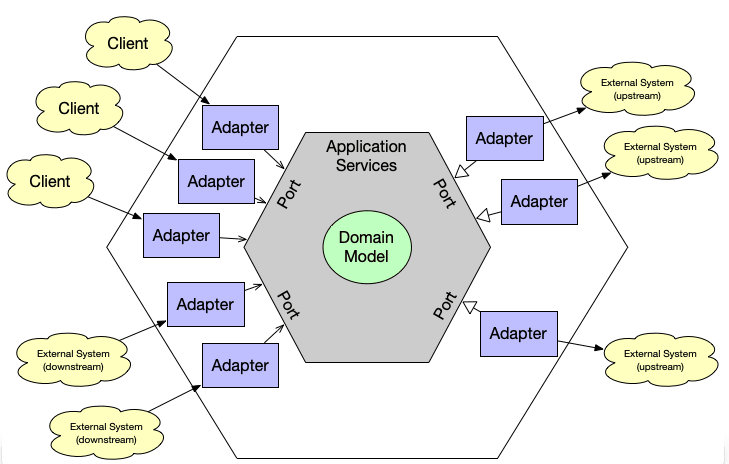

# Tutorial 3: Refatoração para Arquitetura Hexagonal

## Java Spring Boot + SQLite + Clean Architecture

### Sumário Executivo

Este tutorial refatora o sistema CRUD de usuários da **arquitetura em 3 camadas** para **Arquitetura Hexagonal** (também conhecida como **Ports and Adapters** ou **Clean Architecture**), aplicando conceitos avançados de **Domain-Driven Design (DDD)** e **princípios de Clean Code**.

Acesso ao código em 3 camadas para iniciar o tutorial:
[Acesse o repositório no GitHub](https://github.com/leonardorsolar/user-hexagonal-java-1-2-crud)

---

## Parte 1: Fundamentos da Arquitetura Hexagonal

### 1.1 O que é Arquitetura Hexagonal?

A **Arquitetura Hexagonal** foi criada por **Alistair Cockburn**.
A Arquitetura Hexagonal, também chamada de Ports and Adapters, é um modelo de organização de software que separa a lógica de negócio (o núcleo da aplicação) das partes externas, como banco de dados, APIs e interface web.

Vamos visualizar forma de vermos a Arquitetura para entendermos melhor como aplicá-la.


-   A regra de negócio fica no centro (núcleo).

-   As interfaces externas (como controller, banco de dados, e-mail) se conectam ao núcleo por meio de portas (interfaces) e adaptadores (implementações).

-   Isso facilita testes, manutenção e troca de tecnologias.

🧠 Exemplo simples:
Você pode trocar o banco de dados sem mudar a lógica da aplicação.

Pode testar tudo sem subir o servidor.

Vamos comprender mais a base desta arquitetura.

```
+---------------------+
|   InterfaceClasse  |  <<interface>>
+---------------------+
          ^
          |
+---------------------+
|     ClasseImpl     |  implements InterfaceClasse (classe concreta)
+---------------------+
```

## O que é **implementar uma interface**?

É criar uma classe que **segue esse contrato**, ou seja, define o comportamento dos métodos que foram apenas declarados na interface.

---

### 🧩 Exemplo da interface:

```java
public interface UsuarioService {
    UsuarioDTO criar(CreateUsuarioDTO dto);
    UsuarioDTO atualizar(Long id, UpdateUsuarioDTO dto);
    void deletar(Long id);
}
```

Essa interface define **o que deve ser feito**, mas **não diz como**.

---

### 🔧 Exemplo da implementação:

```java
public class UsuarioServiceImpl implements UsuarioService {

    @Override
    public UsuarioDTO criar(CreateUsuarioDTO dto) {
        // Aqui você coloca a lógica para criar um usuário
    }

    @Override
    public UsuarioDTO atualizar(Long id, UpdateUsuarioDTO dto) {
        // Aqui você coloca a lógica para atualizar um usuário
    }

    @Override
    public void deletar(Long id) {
        // Aqui você coloca a lógica para deletar um usuário
    }
}
```

---

### ✅ Resumo:

-   A **interface** é o **contrato**: define _o que precisa ser feito_.
-   A **classe que implementa a interface** fornece a **lógica real**: define _como isso será feito_.

```
`  +---------------------+
  |      Controller      |  <- Adapter (classe concreta)
  | (UsuarioController)  |
  +----------+----------+
             |
             v
     +-----------------+
     |   Input Port    |  <- Interface
     | (UsuarioService)|
     +-------+---------+
             ^
             |
     +--------------------+
     |     **Core**       |  <- Implementação da lógica (classe concreta)
     |(UsuarioServiceImpl)|
     +-------+------------+
             |
             v
    +--------------------+
    |  Output Port       |  <- Interface
    | (UsuarioRepository)|
    +-------+------------+
             ^
             |
  +-------------------------+
  |      Adapter            |
  | (UsuarioRepositoryImpl) |   <- Adapter (classe concreta)
  |     Database            |
  +--------------------------+`

```

### Observe aqui que o centro UsuarioServiceImpl (Core da aplicação) aponta (usa) a classe de cima (UsuarioService) e aponta (usa) a classe de baixo (UsuarioRepository) e as classe que a core usa são interfaces (contratos) e não classe concretas.

---

-   **Controller (Adapter):** recebe requisições e chama o InputPort.
-   **InputPort (Interface):** define os métodos que o Controller usa.
-   **Core (Implementação):** a lógica do serviço implementa InputPort.
-   **OutputPort (Interface):** abstrai o acesso a dados.
-   **Adapter (Database):** implementa OutputPort para persistência real.

### 🔁 Diagrama **sem interfaces (acoplado)** para comparar:

```text
  +---------------------+
  |     Controller      |
  | (UsuarioController) | (classe concreta)
  +----------+----------+
             |
             v
     +--------------------+
     |     Service        |
     |(UsuarioServiceImpl)|  (classe concreta)
     +--------+-----------+
              |
              v
     +--------------------------+
     |     Repository Impl      |  (classe concreta)
     | (UsuarioRepositoryImpl)  |
     +--------------------------+
```

### 🧨 Problema aqui:

-   O `Controller` chama diretamente a implementação (`ServiceImpl`), que por sua vez chama diretamente o `RepositoryImpl`.
-   Isso **viola o DIP (Princípio da Inversão de Dependência)**.
-   Torna o sistema mais rígido e difícil de testar.

---

### ✅ Já o primeiro diagrama:

-   Usa **interfaces entre as camadas**, garantindo **desacoplamento**.
-   Permite trocar implementações facilmente.
-   Favorece testes com _mocks_ e simulações.

### Outra forma de visualizar o diagrama:

```
┌───────────────────────────────────────────────────────────┐
│                     WORLD OUTSIDE                         │
│  ┌──────────────┐  ┌──────────────┐  ┌──────────────┐     │
│  │   Web API    │  │   Database   │  │  External    │     │
│  │  (Adapter)   │  │  (Adapter)   │  │   Services   │     │
│  └──────┬───────┘  └──────┬───────┘  └──────┬───────┘     │
│         │                 │                 │             │
│  ┌──────▼───────┐  ┌──────▼───────┐  ┌──────▼───────┐     │
│  │ Input Port   │  │Output Port   │  │Output Port   │     │
│  │(Interface)   │  │(Interface)   │  │(Interface)   │     │
│  └──────┬───────┘  └──────┬───────┘  └──────┬───────┘     │
│         │                 │                 │             │
│         └─────────────────┼─────────────────┘             │
│                           │                               │
│    ┌─────────────────────▼─────────────────────┐          │
│    │           HEXAGON (CORE)                  │          │
│    │                                           │          │
│    │  ┌─────────────────────────────────────┐  │          │
│    │  │         APPLICATION LAYER           │  │          │
│    │  │     (Use Cases / Services)          │  │          │
│    │  │                                     │  │          │
│    │  │  ┌─────────────────────────────┐    │  │          │
│    │  │  │       DOMAIN LAYER          │    │  │          │
│    │  │  │   (Entities / Business)     │    │  │          │
│    │  │  │                             │    │  │          │
│    │  │  └─────────────────────────────┘    │  │          │
│    │  └─────────────────────────────────────┘  │          │
│    └───────────────────────────────────────────┘          │
└───────────────────────────────────────────────────────────┘
```

Outra base para entender a arquitetura Hexagonal é o conceito de Inversão de Dependência (ou Inversão de Controle)

## 🧱 Fundamento da Arquitetura Hexagonal: **Inversão de Dependência (DIP)**

Antes de entender a arquitetura Hexagonal, é importante conhecer um conceito essencial chamado **Inversão de Dependência**, que também é conhecido como **Inversão de Controle**.

---

## 🚦 O que é o DIP (Princípio da Inversão de Dependência)?

> O DIP diz que **as partes mais importantes do sistema (alto nível)** não devem depender diretamente dos **detalhes técnicos (baixo nível)**.
> Em vez disso, **ambos devem depender de uma interface (abstração)** que define o que precisa ser feito, mas não como.

---

### 🧠 De forma simples:

-   **Alto nível** → define **o que** o sistema deve fazer.
    Exemplo: a classe `UsuarioService`, onde está a lógica de negócio.

-   **Baixo nível** → cuida de **como** as coisas acontecem.
    Exemplo: `UsuarioRepository`, que salva os dados no banco.

---

## 🤝 Como eles se comunicam?

➡️ Através de **interfaces** (ou contratos).
Assim, o código principal do sistema **não precisa conhecer os detalhes técnicos**.

---

Vejamos mais um diagrama:

```
        +------------------------+
        |  UsuarioService        |  <- Código de alto nível
        |------------------------|
        | - usuarioRepository    |   <- Injeção de dependência na classe UsuarioService
        +-----------+------------+
                    |
                    v
        +------------------------+
        |  UsuarioRepository     |  <- Interface (abstração - contrato)
        +-----------+------------+
                    ^
                    |
        +------------------------+
        | UsuarioRepositoryImpl  |  <- Código de baixo nível (implementação da interface)
        +------------------------+
```

Interpretação:

-   UsuarioService (nível alto) depende da interface UsuarioRepository, e não sabe nem se importa com quem a implementa.
-   UsuarioRepositoryImpl (nível baixo) é quem realmente implementa o contrato da interface e executa a ação real de salvar.
-   Isso é a essência do DIP: alto e baixo nível não se conhecem diretamente, e tudo depende de interfaces.

## ✅ Exemplo prático no seu projeto:

```java
// Interface: contrato entre alto e baixo nível
public interface UsuarioRepository {
    void salvar(Usuario usuario);
}

// Baixo nível implementa esse contrato
public class UsuarioRepositoryImpl implements UsuarioRepository {
    public void salvar(Usuario usuario) {
        // lógica que salva no banco de dados
    }
}

// Alto nível (serviço) usa a interface, não a implementação concreta
public class UsuarioService {
    private final UsuarioRepository usuarioRepository;

    public UsuarioService(UsuarioRepository usuarioRepository) {
        this.usuarioRepository = usuarioRepository;
    }

    public void registrarUsuario(Usuario usuario) {
        usuarioRepository.salvar(usuario); // não importa como, apenas que funciona
    }
}
```

---

## 🔌 Analogia simples:

Imagine isso:

-   O celular é o **controller** e precisa ser carregado.
-   O carregado **precisa de um carregador com entrada USB-C** (interface).
-   Qualquer carregador que tenha essa entrada serve, não importa se é da Samsung, Motorola, etc.
-   Alguém te entrega um carregador de qualquer marca (Samsung, Motorola...), desde que seja USB-C (implementação da interface).
-   O carregador real (implementação) é o que executa a ação: entregar energia
-   Você **não precisa saber os detalhes**, só precisa saber que ele encaixa e funciona.

```
            +---------------------+
            |      Celular        |   <- Controller (quem solicita)
            |(Usuário do sistema) |
            +---------+-----------+
                        |
                        v
            +--------------------+
            |     Entrada USB-C   |   <- Interface (abstração)
            | (Contrato esperado) |
            +---------+----------+
                        ^
            ____________|______________________
            |               |                |
            v               v                v
    +-----------+    +-----------+    +-------------+
    | Carregador|    | Carregador|    | Carregador  |
    | Samsung   |    | Motorola  |    | Genérico    |
    +-----------+    +-----------+    +-------------+
(Impl. concreta)    (Impl. concreta)  (Impl. concreta)
```

### 🧠 Tradução para o código:

| Analogia           | Código Spring Boot                    |
| ------------------ | ------------------------------------- |
| Celular            | `Controller`                          |
| Entrada USB-C      | `UsuarioService` (interface)          |
| Carregador Samsung | `UsuarioServiceImpl` (implementação)  |
| Energia fluindo    | `registrarUsuario()` (ação executada) |

---

## Análise do lado esquerdo e direito da arquitetura

Em Arquitetura Hexagonal, o lado do "Driver" (Ator Primário) representa aqueles que iniciam a interação e são sempre representados no lado esquerdo. O lado "Driven" (Ator Secundário) corresponde aos atores que são "acionados" pela aplicação, ou seja, são aqueles que a aplicação chama.


### 🧱 **Centro: A Aplicação**

-   O hexágono central é a **lógica principal do sistema** — o **core** ou **domínio**.
-   Ela **não conhece detalhes externos** como banco de dados, API, ou interface gráfica.

---

### 👉 **Lado esquerdo: Driver Side (Atores Primários)**

-   São **os que iniciam a interação** com o sistema.
-   Ex.: usuário humano, app web/mobile, testes automatizados, sistemas externos.
-   Se conectam com a aplicação por meio de **portas de entrada (Input Ports)**.
-   Adaptadores típicos: **Controllers, CLI, testes automatizados**.

---

### 👈 **Lado direito: Driven Side (Atores Secundários)**

-   São **os que recebem comandos** da aplicação.
-   Ex.: banco de dados, e-mail, impressora, mensageria.
-   São acessados por meio de **portas de saída (Output Ports)**.
-   Adaptadores típicos: **Repositórios, gateways, implementações técnicas**.

---

| Termo           | Papel                                                             |
| --------------- | ----------------------------------------------------------------- |
| **Application** | Núcleo da aplicação, isolado das tecnologias                      |
| **Driver Side** | Quem chama a aplicação (ex.: Controller, User)                    |
| **Driven Side** | Quem é chamado pela aplicação (ex.: Banco de dados, SMTP)         |
| **Input Port**  | Interface usada para entrar no núcleo                             |
| **Output Port** | Interface usada pelo núcleo para se comunicar com o mundo externo |

### 1.2 Conceitos Fundamentais

#### **Ports (Portas)**

-   **Input Ports**: Interfaces que definem casos de uso
-   **Output Ports**: Interfaces que definem dependências externas

#### **Adapters (Adaptadores)**

-   **Primary Adapters**: Iniciam ações (Controllers, CLI, etc.)
-   **Secondary Adapters**: Implementam funcionalidades (Database, APIs, etc.)

#### **Core (Núcleo)**

-   **Domain Layer**: Entidades e regras de negócio
-   **Application Layer**: Casos de uso e orquestração

### 1.3 Vantagens da Arquitetura Hexagonal

#### ✅ **Desacoplamento Total**

-   Domínio independente de frameworks
-   Fácil troca de tecnologias (database, web framework, etc.)

#### ✅ **Testabilidade Máxima**

-   Core pode ser testado sem infraestrutura
-   Mocks simples para adapters

#### ✅ **Flexibilidade**

-   Múltiplos adapters (REST API, GraphQL, CLI)
-   Diferentes bancos de dados (SQLite, PostgreSQL, MongoDB)

#### ✅ **Manutenibilidade**

-   Regras de negócio centralizadas
-   Mudanças de infraestrutura não afetam o core

---


## Parte 2: Estrutura da Arquitetura Hexagonal

Podemos ter várias forma de organizar as pastas do projeto.
A Estrutura a seguir 1 e 2 focam na ideia clássica de Hexagonal Architecture:

-   Separar adaptadores (adapters) que conectam o mundo externo (interfaces, APIs, bancos) da lógica da aplicação (application).

## 🟨 Estrutura 1 com `adapters` e `application`


```text
src/
├── adapters/                             # 🔌 Adaptadores que conectam o mundo externo ao sistema
│   ├── inbound/                          # ↩️ Entrada: recebe requisições externas (ex: APIs, controllers)
│   │   └── controller/                   #    └── Controladores REST ou HTTP que iniciam os casos de uso
│   └── outbound/                         # ↪️ Saída: comunica com sistemas externos (ex: banco de dados, serviços)
│       └── repository/                   #    └── Implementações de persistência (ex: JPA, Mongo, JDBC)

├── application/                          # 🧠 Lógica de aplicação (casos de uso e orquestração)
│   ├── core/                             #    🔁 Núcleo da aplicação (sem dependências externas)
│   │   ├── service/                       #     ⚙️ Implementações dos casos de uso (ex: CriarUsuarioService.java)
│   │   └── domain/                       #       Entidades de negócio e regras do domínio
│   └── ports/                            #    🚪 Interfaces que definem os contratos da aplicação
│       ├── in/                           #       ↩️ Portas de entrada: contratos dos casos de uso
│       └── out/                          #       ↪️ Portas de saída: contratos com infraestrutura (repos, serviços)
├── shared/
```

-   Adapters é o termo clássico da arquitetura hexagonal para os componentes que adaptam o sistema ao ambiente externo.
-   A pasta application pode conter o que chamamos de casos de uso, serviços e portas (interfaces)
-   Nomes como inbound e outbound explicam claramente o fluxo (entrada/saída).
-   core é um termo mais genérico.

Outra forma de se expressas

## 🟨 Estrutura 2 com `adapters` e `application`

```text
src/
├── adapters/                             # 🔌 Adaptadores que conectam o mundo externo ao sistema
│   ├── in/                               # ↩️ Entrada: recebe requisições externas (ex: APIs, controllers)
│   │   └── web/
│   │        └── controller/              #    └── Controladores REST ou HTTP que iniciam os casos de uso
│   └── out/                              # ↪️ Saída: comunica com sistemas externos (ex: banco de dados, serviços)
│       └── persistence/
│              └── repository/            #    └── Implementações de persistência (ex: JPA, Mongo, JDBC)
│
├── application/                          # 🧠 Lógica de aplicação (casos de uso e orquestração)
│   ├── domain/                           #    🔁 Núcleo da aplicação (sem dependências externas)
│   │   ├── service/                      #     ⚙️ Implementações dos casos de uso (ex: CriarUsuarioService.java)
│   │   └── model/                        #       Entidades de negócio e regras do domínio
│   └── ports/                            #    🚪 Interfaces que definem os contratos da aplicação
│       ├── in/                           #       ↩️ Portas de entrada: contratos dos casos de uso
│       └── out/                          #       ↪️ Portas de saída: contratos com infraestrutura (repos, serviços)
│
├── common/
```

Vejo aqui um problema conceitual:

-   Domain dentro da pasta application - Quebra o conceito hierárquico, domínio não é aplicação
    Separe domínio e aplicação em pastas distintas seria o ideal
-   Pasta service dentro do domain na aplicação. Confunde serviço de domínio com serviço de aplicação. Deve-se separar os serviços de domínio e serviços de aplicação claramente

Vamos ver mais uma estrutura:

A estrutura 3 já traz um estilo mais alinhado com DDD (Domain-Driven Design) + Clean Architecture, onde:

-   O projeto é modularizado por domínios ou features (ex: módulo user)
-   Tem camadas bem definidas e com nomes bem explícitos: domain (regras de negócio puras), application (casos de uso), infrastructure (implementações concretas, adaptadores).
-   É uma forma mais robusta, clara para sistemas maiores e com múltiplos domínios, que facilita modularização e manutenção.

## 🟨 Estrutura 3 com `domain` , `application` e `infrastructure`

-   Domain = Core: Regras de negócio puras, modelos do negócio. O "coração" do sistema.
-   Application: Camada que usa o domínio para realizar tarefas, orquestra casos de uso, interage com o mundo externo e infraestrutura.
-   Core: Palavra usada para enfatizar o domínio como o núcleo independente, o "coração" que não depende de nada



Reflete os níveis lógicos da aplicação (domínio → aplicação → infraestrutura).
Facilita a visualização da separação de responsabilidades (DDD + Hexagonal + Clean Architecture)
Adapta-se melhor à modularização por domínio, caso o sistema cresça.
Mais flexível para projetos reais

### O que faz o Domain (Domínio) de forma simples?

O Domain é o lugar onde ficam as regras de negócio verdadeiras — ou seja, as regras do problema real que o sistema resolve.Ele representa o que o negócio exige, independentemente de tecnologia, interface ou banco de dados.Aqui ficam as entidades, seus comportamentos, e regras que garantem que o negócio funcione direito.
Exemplo:
No domínio você terá:
Cliente que sabe se está ativo ou não.
Pedido que sabe quando pode ser confirmado.

### O que faz a Application (Aplicação) de forma simples?

A Application organiza a lógica de uso do sistema, ou seja, ela diz como as regras de negócio do domínio são usadas para realizar tarefas.Ela controla o fluxo, chama os objetos do domínio, interage com bancos, serviços externos, e prepara dados para a interface.
Não contém regras do negócio, mas sim orquestra o processo para cumprir um caso de uso.
Exemplo:
Na aplicação você terá:
Um serviço que recebe uma requisição para criar pedido, verifica dados, chama o domínio para criar o pedido e grava no banco.
Ela garante que tudo aconteça na ordem certa.

```text
src/main/java/com/exemplo/hexagonal/
├── HexagonalApplication.java               # 🚀 Classe principal que inicia a aplicação Spring Boot
│
├── user/                                   # 🧍 Módulo de Usuário (Feature modularizada isoladamente)
│   ├── domain/                             # 🧠 Núcleo do domínio do usuário (regra de negócio pura)
│   │   └── entities/                          # 📦 Entidades do domínio (ex: Usuario.java)
│
│   ├── application/                        # 💡 Camada de aplicação (orquestra os casos de uso)
│   │   ├── port/                           #     🚪 Portas: interfaces que expõem (input) e consomem (output) funcionalidades
│   │   │   ├── input/                      #       ↩️ Casos de uso oferecidos ao mundo externo (ex: CriarUsuarioUseCase.java)
│   │   │   └── output/                     #       ↪️ Contratos com serviços externos (ex: UsuarioRepositoryPort.java)
│   │   ├── service/                        #     ⚙️ Implementações dos casos de uso (ex: CriarUsuarioService.java)
│   │   └── dto/                            #     📤 Objetos de transferência de dados (ex: CreateUsuarioDTO, UpdateUsuarioDTO)
│
│   ├── infrastructure/                     # 🛠️ Implementações concretas de acesso externo (adaptadores e configurações)
│   │   ├── adapter/                        #     🔌 Adaptadores conectando o domínio com o mundo externo
│   │   │   ├── input/web/                  #       🌐 Adaptadores de entrada (ex: REST Controllers)
│   │   │   │   └── UsuarioController.java  #         → Recebe requisições HTTP e chama os casos de uso
│   │   │   └── output/persistence/         #       🗄️ Adaptadores de saída (ex: banco de dados, via JPA)
│   │   │       └── UsuarioRepositoryAdapter.java #   → Implementa a interface de repositório definida na camada de aplicação
│   │   └── encoder/, email/                #     🔐 Serviços externos (ex: codificador de senha, envio de e-mail)
│   │
│   └── mapper/                             # 🔄 Conversores entre entidades, DTOs e objetos de persistência
│       └── UsuarioMapper.java
│
├── shared/                                 # 📦 Código genérico e reutilizável entre módulos
│   ├── config/
│   │   └── (DatabaseConfig.java, BeanConfig.java) # ⚙️ Configurações globais da aplicação
│   ├── exception/                                 # ❗ Tratamento de exceções genéricas da aplicação
│   │   └── GlobalExceptionHandler.java
│   └── util/                                      # 🧰 Utilitários diversos compartilhados entre módulos

```

No DDD clássico, domain representa o núcleo do negócio, com entidades, agregados e regras puras.
O nome model vem da tradição MVC (Model-View-Controller) e significa "modelo de dados". Algumas pessoas usam model para representar entidades do domínio. Termo vago, misturado com conceito MVC tradicional. Mas em arquiteturas baseadas em DDD, o termo mais adequado é "entities", "domain model" ou simplesmente "domain".

Resumo das vantagens dessa estrutura:
Altamente didática: cada camada e módulo tem seu espaço e responsabilidade.
Organização modular (por feature): permite escalar para vários domínios como account/, product/, etc.
Segregação limpa entre domínio, aplicação e infraestrutura.
Facilita testes, manutenção e colaboração entre times.

Essas diferenças de nomenclatura e organização entre as estruturas são bem comuns e refletem variações do mesmo conceito básico da Arquitetura Hexagonal, adaptadas para diferentes estilos, objetivos e níveis de maturidade do projeto.

### ✅ Estrutura Modular por Módulo / Feature ( módulo User)

```text
src/main/java/com/exemplo/hexagonal/
├── HexagonalApplication.java
├── user/                              # 🧍 Módulo de Usuário
│   ├── domain/                        # ← CORE do módulo usuário
│   │   ├── entities/ (Usuario.java)
│   │   └── exception/
│   ├── application/
│   │   ├── port/
│   │   │   ├── input/ (CriarUsuarioUseCase.java)
│   │   │   └── output/ (UsuarioRepositoryPort.java)
│   │   ├── service/ (CriarUsuarioService.java)
│   │   └── dto/
│   ├── infrastructure/
│   │   ├── adapter/
│   │   │   ├── input/web/ (UsuarioController.java)
│   │   │   └── output/persistence/
│   │   │       ├── UsuarioRepositoryAdapter.java
│   │   │       └── UsuarioEntity.java
│   │   └── encoder/, email/
│   └── mapper/ (UsuarioMapper.java)
│
├── shared/                            # 📦 Código compartilhado (se necessário)
│   ├── config/ (DatabaseConfig.java, BeanConfig.java)
│   ├── exception/ (GlobalExceptionHandler.java)
│   └── util/
```

-   **Modularização por módulo de negócio (ex: `user`)**: Cada módulo é praticamente um "mini hexágono" isolado, com seu próprio domínio, aplicação e infraestrutura.
-   **Foco na organização modular**: Tudo referente ao usuário fica dentro do módulo `user/`.
-   **Separa claramente as camadas dentro do módulo**:

    -   `domain/` (modelo e regras do domínio do usuário)
    -   `application/` (casos de uso, serviços, portas)
    -   `infrastructure/` (adaptadores de entrada e saída, implementações concretas)

-   **`shared/` para código comum entre módulos** (configurações, utilitários, exceções globais)

**Resumo:** Organização por módulos de negócio (exemplo: módulo `user`), onde cada módulo é auto-contido e tem as camadas hexagonais internamente.

### ✅ Estrutura com Módulos: `user` e `account`

```text
src/main/java/com/exemplo/hexagonal/
├── HexagonalApplication.java
├── user/                              # 🧍 Módulo de Usuário
│   ├── domain/                        # ← CORE do módulo usuário
│   │   ├── entities/ (Usuario.java)
│   │   └── exception/
│   ├── application/
│   │   ├── port/
│   │   │   ├── input/ (CriarUsuarioUseCase.java)
│   │   │   └── output/ (UsuarioRepositoryPort.java)
│   │   ├── service/ (CriarUsuarioService.java)
│   │   └── dto/
│   ├── infrastructure/
│   │   ├── adapter/
│   │   │   ├── input/web/ (UsuarioController.java)
│   │   │   └── output/persistence/
│   │   │       ├── UsuarioRepositoryAdapter.java
│   │   │       └── UsuarioEntity.java
│   │   └── encoder/, email/
│   └── mapper/ (UsuarioMapper.java)
│
├── account/                           # 🏦 Módulo de Conta Bancária
│   ├──
│
├── shared/                            # 📦 Código compartilhado (se necessário)
│   ├── config/ (DatabaseConfig.java, BeanConfig.java)
│   ├── exception/ (GlobalExceptionHandler.java)
│   └── util/
```

Deste que utizemos a inversão de dependência podemos estruturar as pastas da nossa maneira.

-   Core (Domínio): é o coração da aplicação. Não conhece o banco, nem o Spring. Contém a lógica pura.
-   Application Layer: orquestra os casos de uso. Usa interfaces (ports) para se comunicar com o mundo externo.
-   Infrastructure: é o mundo externo — onde ficam os detalhes concretos (Web, Banco de Dados, Email...).
-   Adapters: ligam o mundo externo (Infra) ao core, implementando as interfaces da camada de aplicação.

### Estrutura Separação por Camadas Globais sem modularização explícita

Separação maior de responsabilidades. Aqui temos o domínio rico, com a regras de negócio separada da aplicação.

```bash
src/main/java/com/exemplo/hexagonal/
├── HexagonalApplication.java          # Classe principal (Spring Boot)
│
├── domain/                            # 💠 Núcleo (Domínio - Core do Hexágono)
│   ├── model/                         # → Entidades do domínio (regras e estado)
│   │   ├── Usuario.java
│   │   └── Email.java
│   ├── exception/                     # → Exceções do domínio
│   │   ├── DomainException.java
│   │   ├── UsuarioNotFoundException.java
│   │   └── EmailJaExisteException.java
│   └── service/                       # → Regras de negócio do domínio
│       └── UsuarioDomainService.java
│
├── application/                       # 💡 Camada de Aplicação (Casos de Uso)
│   ├── port/                          # → Portas (interfaces para entrada/saída)
│   │   ├── input/                     # ↪ Input Ports (Interfaces de casos de uso)
│   │   │   ├── CriarUsuarioUseCase.java
│   │   │   ├── BuscarUsuarioUseCase.java
│   │   │   ├── AtualizarUsuarioUseCase.java
│   │   │   └── InativarUsuarioUseCase.java
│   │   └── output/                    # ↪ Output Ports (interfaces para dependências)
│   │       ├── UsuarioRepositoryPort.java
│   │       ├── EmailServicePort.java
│   │       └── PasswordEncoderPort.java
│   ├── service/                       # → Implementações dos casos de uso
│   │   ├── CriarUsuarioService.java
│   │   ├── BuscarUsuarioService.java
│   │   ├── AtualizarUsuarioService.java
│   │   └── InativarUsuarioService.java
│   └── dto/                           # → Objetos de transferência de dados
│       ├── UsuarioDTO.java
│       ├── CreateUsuarioCommand.java
│       └── UpdateUsuarioCommand.java
│
├── infrastructure/                   # 🛠️ Infraestrutura (Adapters + Configurações)
│   ├── adapter/                      # → Adaptadores concretos
│   │   ├── input/                    # ↪ Adaptadores Primários (ex: Web)
│   │   │   └── web/
│   │   │       ├── UsuarioController.java
│   │   │       └── GlobalExceptionHandler.java
│   │   └── output/                   # ↪ Adaptadores Secundários (Banco, Email...)
│   │       ├── persistence/
│   │       │   ├── UsuarioJpaRepository.java
│   │       │   ├── UsuarioRepositoryAdapter.java
│   │       │   └── entity/
│   │       │       └── UsuarioEntity.java
│   │       ├── encoder/
│   │       │   └── BCryptPasswordEncoderAdapter.java
│   │       └── email/
│   │           └── EmailServiceAdapter.java
│   ├── config/                       # → Configurações (Beans, JPA, etc)
│   │   ├── BeanConfiguration.java
│   │   └── DatabaseConfig.java
│   └── mapper/                       # → Conversores (domain <-> entity/dto)
│       ├── UsuarioMapper.java
│       └── UsuarioEntityMapper.java

```

-   **Estrutura clássica da Arquitetura Hexagonal em camadas globais**, não modularizada por features:

    -   `domain/` — núcleo do domínio com entidades, exceções, serviços de domínio
    -   `application/` — casos de uso, portas, DTOs, serviços de aplicação
    -   `infrastructure/` — adaptadores e configurações gerais da infraestrutura

-   **Todas as entidades e serviços do domínio ficam numa pasta única `domain/`**
-   **Todos os casos de uso e serviços de aplicação também ficam em `application/`**
-   **Adaptadores de entrada e saída estão organizados dentro da pasta `infrastructure/`**
-   **Separação mais tradicional e ampla, menos modular**

**Resumo:** Organização em camadas horizontais globais, onde cada camada é única e engloba toda a aplicação.

### Principais diferenças resumidas

| Aspecto              | Estrutura Básica Modular                             | Estrutura Completa em Camadas Globais                        |
| -------------------- | ---------------------------------------------------- | ------------------------------------------------------------ |
| Organização          | Por módulos (ex: módulo user)                        | Por camadas (domain, application, infrastructure)            |
| Isolamento           | Cada módulo tem domínio, aplicação e infra separadas | Domínio, aplicação e infra são globais para toda a aplicação |
| Reuso entre módulos  | Usa `shared/` para componentes comuns                | Código comum fica em camadas (ex: config, mappers) globais   |
| Escalabilidade       | Facilita crescimento com vários módulos              | Pode ficar mais difícil escalar com muitos recursos          |
| Complexidade inicial | Pode ser mais complexa inicialmente                  | Estrutura mais simples para projetos pequenos                |
| Manutenção           | Boa para times grandes e múltiplos domínios          | Melhor para projetos pequenos ou médios                      |

---

### Quando usar cada uma?

-   **Modular** — Projetos maiores, com muitos domínios/módulos, times trabalhando separadamente.
-   **Estrutura Separação por Camadas Globais** — Projetos menores, protótipos, quando a equipe é pequena e o domínio não precisa ser muito fragmentado.

### 2.2 Comparação: 3 Camadas vs Hexagonal

| Aspecto           | 3 Camadas                         | Hexagonal                            |
| ----------------- | --------------------------------- | ------------------------------------ |
| **Acoplamento**   | Controller → Service → Repository | Ports ↔ Adapters                     |
| **Dependências**  | Camadas dependem de frameworks    | Core independe de tudo               |
| **Testabilidade** | Mocks complexos                   | Mocks simples (interfaces)           |
| **Flexibilidade** | Mudanças afetam múltiplas camadas | Mudanças isoladas em adapters        |
| **Complexidade**  | Menor (inicial)                   | Maior (inicial), menor (longo prazo) |

---

# Implementação

Em contrução

# Próximos passos:

## Parte 3: Modularizar e criar novos módulos

### Nova Estrutura

Ótima pergunta! Se você for **modularizar** a aplicação (ex: separando os domínios `user` e `account`), o ideal é **isolar a responsabilidade de cada módulo**, mantendo **a Arquitetura Hexagonal** em cada um, como se cada domínio fosse uma mini-aplicação dentro do projeto.

---

### ✅ Estrutura com Módulos: `user` e `account`

```text
src/main/java/com/exemplo/hexagonal/
├── HexagonalApplication.java
├── user/                              # 🧍 Módulo de Usuário
│   ├── domain/                        # ← CORE do módulo usuário
│   │   ├── model/ (Usuario.java)      # 🔁 Núcleo do domínio (entidades e regras puras)
│       ├── service/                   # Serviços de domínio (regra de negócio complexa)
│   │   └── exception/
│   ├── application/                             # 🧠 Casos de uso / orquestração da aplicação
│   │   ├── port/                                 # Interfaces de entrada e saída (contratos)
│   │   │   ├── input/ (CriarUsuarioUseCase.java)
│   │   │   └── output/ (UsuarioRepositoryPort.java)
│   │   ├── service/ (CriarUsuarioService.java)   # Implementação dos casos de uso (ex: CriarUsuarioService.java)
│   │   └── dto/
│   ├── infrastructure/                            # 🛠️ Implementação concreta (adaptadores, persistência, etc)
│   │   ├── adapter/
│   │   │   ├── input/web/ (UsuarioController.java)
│   │   │   └── output/persistence/
│   │   │       ├── UsuarioRepositoryAdapter.java
│   │   │       └── UsuarioEntity.java
│   │   └── encoder/, email/
│   └── mapper/ (UsuarioMapper.java)
│
├── account/                           # 🏦 Módulo de Conta Bancária
│   ├── domain/
│   │   ├── model/ (Conta.java, Transacao.java)
│   │   └── exception/
│   ├── application/
│   │   ├── port/
│   │   │   ├── input/ (AbrirContaUseCase.java)
│   │   │   └── output/ (ContaRepositoryPort.java)
│   │   ├── service/ (AbrirContaService.java)
│   │   └── dto/
│   ├── infrastructure/
│   │   ├── adapter/
│   │   │   ├── input/web/ (ContaController.java)
│   │   │   └── output/persistence/
│   │   │       ├── ContaRepositoryAdapter.java
│   │   │       └── ContaEntity.java
│   └── mapper/ (ContaMapper.java)
│
├── shared/                            # 📦 Código compartilhado (se necessário)
│   ├── config/ (DatabaseConfig.java, BeanConfig.java)
│   ├── exception/ (GlobalExceptionHandler.java)
│   └── util/
```

A estrutura modularizada por funcionalidade (como user/, account/) é mais didática, mais clara para aprender, escalar e manter, especialmente quando você está explicando para alunos ou iniciando em projetos maiores.

---

### 💡 Benefícios dessa modularização:

| Vantagem                           | Explicação                                              |
| ---------------------------------- | ------------------------------------------------------- |
| **Separação de responsabilidades** | `user` cuida de usuários, `account` cuida de contas     |
| **Reutilização**                   | Você pode mover um módulo para outro projeto, se quiser |
| **Facilidade de testes**           | Cada módulo pode ser testado isoladamente               |
| **Escalabilidade**                 | Pode evoluir cada módulo de forma independente          |

---

# Conhecimentos: Domínio anêmico e rico

Ótima observação! Você apontou um ponto muito comum e importante no desenvolvimento de software: **por que algumas entidades (como essa classe `Usuario`) são "puras" só com dados e validações técnicas, mas não têm regras de negócio explícitas?**

Vou explicar as razões principais para isso e o que isso significa no contexto de arquitetura limpa e DDD:

---

## 1. **Essa classe `Usuario` é um _Entity_ "anêmica"**

-   O código que você mostrou é um exemplo clássico do que chamamos de **Anemic Domain Model** (Modelo de Domínio Anêmico).
-   É uma entidade que contém **apenas atributos (dados) e algumas validações técnicas**, mas quase nenhuma regra de negócio embutida nela.
-   Essa prática é muito comum em projetos que usam JPA/Hibernate porque:

    -   O foco é mapear diretamente para o banco de dados (ORM)
    -   As regras de negócio acabam ficando fora da entidade, geralmente em serviços ou camadas de aplicação.

---

## 2. **Por que isso acontece?**

-   **Separação de preocupações vs praticidade:**
    As entidades JPA precisam ser simples para funcionar bem com o ORM, muitas vezes isso faz os desenvolvedores colocarem regras fora da entidade.
-   **Falta de aplicação estrita de DDD:**
    Nem todo projeto segue os princípios de DDD puro onde as entidades carregam comportamento e regras do negócio. Muitos projetos são mais “CRUD-centric” (focados em criar, ler, atualizar e deletar dados).
-   **Validações técnicas embutidas:**
    As anotações `@NotBlank`, `@Email` e etc são para validar o formato e integridade dos dados, não são regras do negócio.
-   **Regras de negócio estão em outro lugar:**
    Normalmente, as regras como "Usuário só pode ser inativado se não tiver pendências" ficariam em serviços de domínio ou na camada de aplicação.

---

## 3. **Qual o problema dessa abordagem?**

-   Essa “anemia” pode fazer seu modelo de domínio **ficar muito fraco**, pois as regras ficam dispersas, dificultando a manutenção, evolução e teste.
-   Você perde a vantagem de encapsular regras junto com os dados, que é um dos pilares do DDD.

---

## 4. **Quando usar entidades com comportamento?**

-   Quando quiser que o domínio reflita fielmente o negócio, a entidade deve conter comportamentos (métodos) que **garantem as regras de negócio**, e não só dados.
-   Exemplo:

    ```java
    public class Usuario {
        private Boolean ativo = true;
        // ...
        public void inativar() {
            if (temPendencias()) {
                throw new BusinessException("Usuário não pode ser inativado com pendências");
            }
            this.ativo = false;
        }
        // método que verifica regra de negócio
        private boolean temPendencias() {
            // lógica para verificar pendências
        }
    }
    ```

---

## 5. **Resumo**

| Aspecto                       | Entidade “anêmica” (exemplo dado)                   | Entidade rica em comportamento (DDD puro)             |
| ----------------------------- | --------------------------------------------------- | ----------------------------------------------------- |
| Contém                        | Apenas dados e validações técnicas                  | Dados + regras de negócio e comportamento             |
| Onde ficam regras de negócio? | Em serviços ou aplicação                            | Dentro da própria entidade/domain                     |
| Vantagem                      | Fácil para CRUD simples e integração com ORM        | Domínio expressivo, regras encapsuladas, mais robusto |
| Desvantagem                   | Domínio fraco, regras dispersas, difícil manutenção | Pode ser mais complexo para iniciar, exige disciplina |
